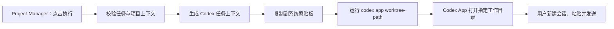

# Project-Manager 向 Codex App 交接任务方案

## 1. 目标

在 Project-Manager 的任务详情页点击“执行”后，将该任务的项目上下文交给本机 Codex App：

- 打开任务指定的项目工作目录（优先为对应 worktree）；
- 提供项目、worktree、分支和需求信息；
- 让用户在 Codex App 中以这些上下文发起一个新的会话。

本阶段只解决“任务交接和打开 Codex”的体验，不需要在 Project-Manager 中展示 Codex 的实时执行状态、最终回复或代码变更。

## 2. 结论与边界

### 2.1 推荐方案：打开项目并复制可直接发送的上下文

Project-Manager 点击“执行”后执行两件事：

1. 使用 `codex app <worktree-path>` 打开 Codex App，并定位到指定工作目录。
2. 将由任务信息生成的上下文复制到系统剪贴板。

用户在 Codex App 中新建会话后，只需粘贴并发送即可开始工作。

该方案不依赖 Codex App 的界面结构，稳定且维护成本低，适合作为 V1。

### 2.2 不能作为 V1 依赖的能力

目前不应假设存在一个稳定的公开接口，可以让第三方 App 同时完成以下操作：

- 把 prompt 写入正在运行的 Codex Desktop App；
- 自动创建其 UI 中的新会话；
- 自动发送该 prompt。

`codex app <path>` 的职责是打开 Desktop App 和工作区，并不是向某个 Desktop 会话注入消息。

### 2.3 可选但不推荐的全自动方案

macOS 可以通过辅助功能（Accessibility）自动化执行“新建会话、粘贴、发送”。但它依赖用户额外授权，并会受到 Codex App 的 UI、焦点和快捷键变化影响。因此不作为 V1 的基础能力。

Codex SDK 或本地 app-server 能以程序化方式创建和运行 Codex 任务，但不能保证任务显示为 Desktop App 中用户可见的新会话；这也不符合本阶段的交接目标。

## 3. 交互流程



## 4. 需要携带的任务上下文

生成上下文时只使用任务和项目配置中已经明确的数据，不根据页面展示文案反向解析。

| 字段 | 来源 | 用途 |
| --- | --- | --- |
| 项目名称、项目 ID | 项目配置 | 让 Codex 知道任务归属 |
| 项目根目录 | 项目配置 | 当 worktree 不可用时用于诊断 |
| worktree 目录 | 任务关联的工作目录 | Codex 实际应打开并工作的目录 |
| 分支名 | 任务关联的分支 | 防止在错误分支修改 |
| 任务 ID、标题、描述 | 任务数据 | 说明具体需求 |
| 验收标准、约束 | 任务数据或项目规则 | 定义完成条件与边界 |

如果 worktree 或分支未配置或不存在，点击执行必须停止并提示明确错误，不能退回到任意项目目录执行。

## 5. 复制到剪贴板的 Prompt 模板

```text
请在以下工作上下文中处理任务。

项目：{{projectName}}（{{projectId}}）
项目根目录：{{projectRoot}}
工作目录：{{worktreePath}}
Worktree：{{worktreeName}}
分支：{{branch}}
任务：{{taskTitle}}（{{taskId}}）

需求：
{{taskDescription}}

验收标准：
{{acceptanceCriteria}}

约束：
- 仅在上述工作目录中操作。
- 先分析原因和方案，再实施。
- 未经明确要求，不要提交、推送或删除文件。
```

缺失的可选字段应整行省略，不能输出 `undefined`、空占位符或猜测出的目录、分支信息。

## 6. 实现边界

### 包含

- 前端“执行”按钮调用 Tauri 原生命令；
- 原生层校验 worktree 目录和分支；
- 原生层将结构化任务上下文写入系统剪贴板；
- 原生层启动 `codex app <worktree-path>`；
- 用户在 Codex App 中自行新建会话并粘贴发送。

### 不包含

- 监听 Codex 会话进度、结果或错误；
- 将 Codex 回复、日志或 Diff 回写到 SQLite；
- 代替用户自动批准 Codex 的敏感操作；
- 通过辅助功能自动点击或向 Codex App UI 注入消息；
- 自动创建 Git worktree 或分支。

## 7. 安全与可靠性要求

- 仅允许打开已在 `projects/*.yaml` 注册的项目，以及该任务明确关联的 worktree。
- 不把任务文本拼入 shell 命令；通过参数数组传递路径，避免命令注入和路径转义问题。
- 不把 Codex 登录凭据、访问令牌或系统环境变量写进任务数据库、剪贴板上下文或日志。
- 工作目录必须存在，且在允许的项目目录范围内；分支校验失败时不打开 Codex。
- 即使本阶段不回写结果，也应在本地仅记录“已发起交接”的轻量操作反馈，避免用户重复点击。

## 8. 验收标准

1. 对包含有效 worktree 和分支的任务点击“执行”，Codex App 打开该 worktree 目录。
2. 系统剪贴板包含完整、可直接发送的任务上下文。
3. Prompt 中的项目、worktree、分支和需求与任务数据完全一致。
4. worktree 缺失、目录越界或分支不匹配时，Project-Manager 显示错误且不启动 Codex。
5. 整个流程不创建 Codex 执行状态记录、不轮询任务结果、不改写任务状态。
6. 不触发 Git 提交、推送或文件删除。

## 9. 后续演进（非本阶段）

若后续需要无人工粘贴的“一键发起会话”，先单独评估 macOS 辅助功能自动化的权限、失败恢复和版本兼容性；不能把它与稳定的项目打开/剪贴板交接流程耦合。

若后续需要 Project-Manager 显示 Codex 进度和结果，可另行设计 `codex exec --json`、Codex SDK 或 app-server 的运行记录模型。这是程序化任务编排能力，与“在 Desktop App 中打开一个可见会话”是两个不同的产品边界。

## 10. 参考

- [Codex `app` 命令](https://learn.chatgpt.com/docs/developer-commands?surface=cli#cli-codex-app)
- [Codex SDK](https://learn.chatgpt.com/docs/codex-sdk)
- [Codex 非交互式运行](https://learn.chatgpt.com/docs/non-interactive-mode)
