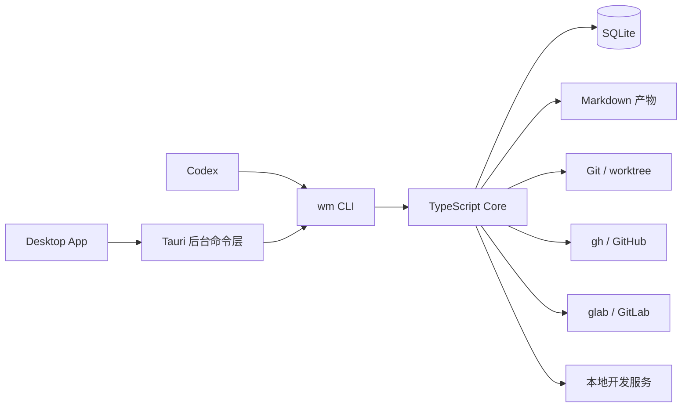

# 个人工作管理助手 V1 续篇设计

> 状态：已完成设计确认，待实施规划  
> 日期：2026-07-17  
> 关联基线：`个人工作管理助手-设计文档.md`（v0.1）

## 1. 本文目的与范围

本文固化在基线设计之上已确认的 V1 决策，重点补足双 Issue 平台、运行数据位置、多开发服务、桌面端交互和可恢复性约束。基线设计中未被本文替换的内容继续有效。

V1 的目标是让单个用户在 Codex、CLI 与 Desktop App 中一致地管理本地研发任务，并在任务切换时快速恢复可靠上下文。

不包含多人协作、云同步、自动推送/建 PR/合并、终端启动入口、删除 worktree 或分支等能力。

## 2. 已确认决策

| 主题 | 决策 |
|---|---|
| Core 与 CLI 运行时 | TypeScript / Node.js |
| Desktop 技术 | Tauri + React + TypeScript；Rust 仅作为桌面系统集成层 |
| Issue 平台 | V1 同时支持 GitHub 与 GitLab |
| 项目对应平台 | 每个项目恰好选择 `github`、`gitlab` 或 `none` 之一 |
| Issue 认证 | 复用本机 `gh` / `glab` 的登录态与凭证管理 |
| SQLite 位置 | macOS 应用数据目录，不纳入工作管理仓库 |
| Markdown 位置 | 工作管理仓库的 `data/artifacts/<taskId>/` |
| 开发服务 | 每个项目支持多个命名服务；每项独立启动、停止与探测 |
| App 首页 | 看板优先 |
| 任务详情 | 从看板进入完整详情页 |
| App 终端能力 | 不提供“打开终端” |
| 完成后资源 | 默认保留分支、worktree、产物与事件 |
| 任务编号 | 项目内单调递增，永不复用，不支持手工指定 |

## 3. 运行架构



### 3.1 唯一操作通道

`wm` 是结构化任务操作的唯一入口。Codex 直接调用 `wm`；Desktop App 通过 Tauri 后台执行受控的 `wm --json` 子进程，并按返回结果刷新界面。

App 不直接写 SQLite，不直接操作 Git，也不重复实现状态机。CLI 同样不承载重复领域逻辑，只负责参数解析、调用 Core 与渲染人类摘要或 JSON 响应。

这样，同一项“暂停任务”无论来自 App、Codex 还是终端，均经过完全一致的校验、事件记录和错误处理。

### 3.2 Core 模块边界

| 模块 | 职责 |
|---|---|
| `TaskService` | 创建任务、状态流转、进展、上下文、完成与重开 |
| `ProjectService` | 读取和校验项目 YAML，注册与刷新项目摘要 |
| `ArtifactService` | 创建、原子写入与读取任务 Markdown 产物 |
| `IssueService` | 按项目选择提供方，创建/关联/读取 Issue |
| `WorkspaceService` | 分支命名、Git 检查、worktree 创建与状态探测 |
| `EnvironmentService` | 命名开发服务的启动、停止、PID 与健康探测 |
| `DoctorService` | 检查数据库、文件、外部资源和进程的一致性 |
| `EventService` | 追加不可变审计事件，并脱敏诊断元数据 |

Core 依赖 Repository 和 Adapter 接口，而不依赖 CLI 或 App。每个适配器都接收已校验的参数数组、受控工作目录和受限路径。

## 4. 数据位置与事实来源

### 4.1 本地路径

| 数据 | 建议位置 | 作用 |
|---|---|---|
| SQLite | `~/Library/Application Support/work-manager/work-manager.db` | 任务状态、关系、事件和开发服务记录 |
| Markdown | `<工作管理仓库>/data/artifacts/<taskId>/` | 需求、上下文、计划、进展和完成总结 |
| 项目配置 | `<工作管理仓库>/projects/*.yaml` | 仓库、模板、平台与开发服务规则 |

数据库为结构化事实来源；Markdown 是长文本与可读上下文来源。二者均不承担对方的职责。该布局不提供跨机器同步；备份、导出与迁移属于后续版本能力。

### 4.2 关键模型调整

保留基线中的 `projects`、`tasks`、`task_artifacts`、`task_events`，并采用以下调整：

- 任务应持久化 `issue_provider`，防止项目配置日后变更而误解历史 Issue 的来源。
- `tasks` 的 `issue_number`、`issue_url`、`pull_request_number` 与 `pull_request_url` 保持平台无关。
- 以 `development_services` 取代单一 `development_sessions`；联合唯一键为 `(task_id, service_key)`。
- `development_services` 至少包含 `command`、`cwd`、`pid`、`port`、`health_check_url`、`status`、`started_at`、`stopped_at`、`last_error`。

`task_events` 是只追加的审计日志。任何成功或失败的 Git、worktree、Issue、服务或任务状态操作都必须写事件，且事件元数据不得含令牌、Cookie、请求头或完整环境变量。

## 5. 项目配置与双平台 Issue

每个项目只能选择一种 Issue 提供方，避免同一个任务默认创建两份重复 Issue；不同项目可分别使用 GitHub 和 GitLab。

```yaml
id: eos-web
name: EOS Web
taskPrefix: EOS
repositoryPath: /Users/you/workspace/eos-web
defaultBranch: develop

issue:
  provider: gitlab # github | gitlab | none
  repository: group/project
  labels:
    feature: [feature]
    bug: [bug]

development:
  services:
    web:
      cwd: .
      startCommand: pnpm dev
      healthCheckUrl: http://localhost:3000
    api:
      cwd: apps/api
      startCommand: pnpm dev
      healthCheckUrl: http://localhost:3001/health
```

Core 定义统一 `IssueProvider` 接口，最少提供：验证认证与仓库可访问性、创建 Issue、获取 Issue、关联既有 Issue、生成 Web 链接。GitHub 适配器通过参数数组调用 `gh`；GitLab 适配器通过参数数组调用 `glab`。

`wm project validate <project>` 必须验证：对应 CLI 存在、当前登录有效、目标仓库可访问、配置路径与命令格式合法。工作管理器不读取、复制或存储 `gh` / `glab` 的凭证。

## 6. CLI 与关键流程

### 6.1 命令补充

```bash
wm task create --project eos-web --title "任务列表批量删除" \
  --type feature --priority high --create-issue --create-worktree --json

wm task retry EOS-132 --json
wm task attach-issue EOS-132 --url "https://..." --json
wm env start EOS-132 --service web --json
wm env stop EOS-132 --service web --json
wm env status EOS-132 --json
wm task doctor EOS-132 --json
```

`task create` 允许在一次用户意图中创建 Issue 和 worktree，但每个外部步骤独立记录。若中途失败，`task retry` 只执行尚未完成或已确认可重试的步骤，绝不盲目重复创建资源。

### 6.2 创建与重试规则

1. 校验项目、类型、优先级、路径、模板变量和基准分支。
2. 在 SQLite 中分配不可复用的任务编号，创建任务与 `task_created` 事件。
3. 按需创建 Issue；成功后立即持久化平台、编号、URL 和事件。
4. 按需创建分支和 worktree；成功后立即持久化路径和事件。
5. 创建并登记基础 Markdown 产物。
6. 所有预期资源准备完成后，转为 `ready`。

若步骤 3 或 4 失败，系统保留任务和已成功资源，写入 `operation_failed`，并返回部分成功与可执行的恢复动作。不得隐式删除已创建的外部资源。

### 6.3 进展写入

`wm task progress <id> --current ... --next ...` 必须同时维护任务的 `current_progress`、`next_action`、`progress.md` 与 `progress_updated` 事件。

Markdown 写入采用临时文件后原子替换；SQLite 中的字段与事件在同一数据库事务中提交。发生文件或数据库错误时，命令明确失败并留下可由 `doctor` 检出的诊断信息，不静默覆盖任一事实来源。

### 6.4 开发服务

服务按任务和名称独立运行：`wm env start EOS-132 --service web`。启动前检查任务 worktree、服务配置和路径；启动后记录实际命令、目录、PID、端口与状态。

V1 只探测 PID 和可选健康检查 URL，不做进程守护、自动重启、端口分配或日志聚合。停止服务只影响指定任务的指定服务。

## 7. Desktop App

### 7.1 页面与导航

默认进入看板。顶部导航包含“看板”“项目”“设置”；任务详情使用完整页面，并提供返回看板的明确路径。

看板默认展示 `in_progress`、`blocked`、`ready` 任务，可按项目、状态、优先级和文本搜索筛选。`done` 与 `cancelled` 通过筛选显式查看。

任务卡片必须依序清晰呈现：标题与状态、`nextAction`、项目与优先级、最后更新时间、阻塞原因或服务状态。卡片不能只显示标题和状态。

### 7.2 任务详情页

详情页分为以下信息区：

- 概览：状态、优先级、需求摘要、当前进展和下一步行动。
- 上下文与产物：需求、上下文、计划、进展、完成总结的预览与打开入口。
- 资源：Issue / PR、分支、worktree 和配置健康状态。
- 开发服务：各命名服务的状态、端口、最后错误与受控启动/停止操作。
- 事件时间线：成功操作、失败原因和建议恢复动作。

允许的 App 操作仅为：复制 Codex 上下文、在 Finder 打开 worktree、打开 Issue/PR URL、启动或停止指定开发服务、暂停、恢复、标记完成。每项操作都调用 `wm --json`，并展示加载、成功或失败状态。

App 不提供打开终端、创建/删除 worktree、创建/删除分支、push、创建 PR、合并或资源删除。

## 8. 安全与可恢复性

- 将文件路径转换为绝对路径后，必须验证其属于注册仓库、该项目的 worktree 根目录或工作管理器数据目录。
- 禁止把任务标题、slug、路径或用户输入直接拼进 shell；外部命令必须使用参数数组和受控工作目录。
- 默认禁止后台自动 push、创建 PR、合并、删除分支和删除 worktree。
- `wm task doctor <id>` 检查数据库、Markdown、分支、worktree、Issue 可访问性和开发服务 PID，输出不一致项、已知事实与建议命令。
- 所有面向用户的失败响应包含稳定错误码、人类可读说明、是否可恢复，以及建议的下一步。

## 9. 测试策略与 V1 验收

### 9.1 测试层级

| 层级 | 覆盖范围 |
|---|---|
| 单元测试 | 状态机、编号、分支模板、路径校验、YAML 校验和双平台接口一致性 |
| 集成测试 | SQLite 迁移、任务创建/重试、Markdown 与事件写入、worktree 操作、多服务状态和 doctor |
| 适配器测试 | 使用 `gh` / `glab` 命令替身；不操作真实远程仓库 |
| App 测试 | 看板筛选、完整详情页、快捷操作、加载态与错误反馈 |

### 9.2 验收结果

- 用户能从 Codex 创建任务，并取得稳定的本地任务 ID、可选 Issue、分支、worktree 和上下文产物。
- GitHub 与 GitLab 项目都能在不泄露凭证的前提下创建或关联 Issue。
- 用户能从看板发现所有活跃任务及其下一步行动，并进入完整详情页恢复上下文。
- 用户能单独启动、停止并检查同一任务下的多个命名开发服务。
- 任何部分失败均能说明已成功资源、失败原因和精确恢复方式；重试不重复创建资源。
- App、CLI 与 Codex 对同一任务显示一致的状态与关联信息。
- V1 不会因任何快捷操作隐式删除代码、分支、worktree 或远程资源。

## 10. 实施分期

1. **核心基础**：仓库结构、共享类型、SQLite 迁移、项目 YAML 校验、任务状态机、事件与 Markdown 产物。
2. **CLI 闭环**：项目管理、任务创建/流转/上下文/进展、JSON 契约、doctor 与重试。
3. **本地资源**：Git/worktree 适配器、多命名开发服务、路径和进程安全约束。
4. **双 Issue 提供方**：`gh` 与 `glab` 适配器、认证校验、创建/关联/失败恢复。
5. **Desktop App**：看板、完整详情页、受控 `wm --json` 调用、状态与错误展示。
6. **端到端验证**：双平台样例项目、部分失败恢复、跨入口一致性和安全回归测试。

每个阶段均应可独立验证。未通过前一阶段的状态、事件和错误恢复验收，不进入依赖它的后续阶段。
